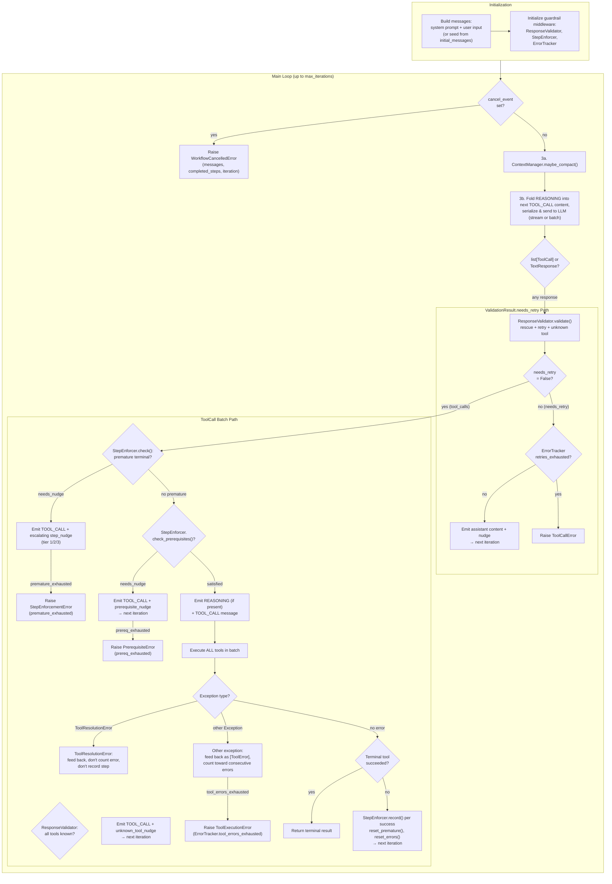
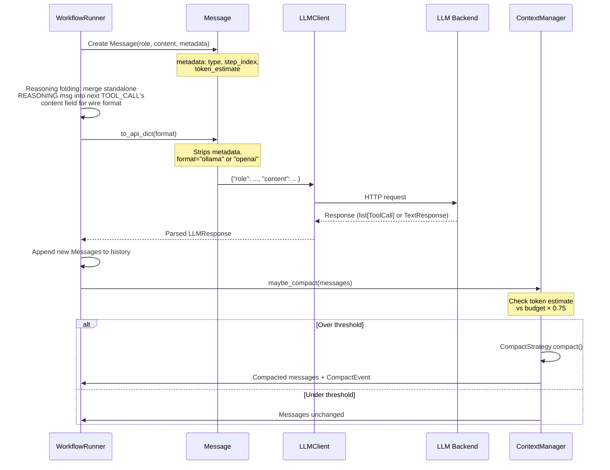
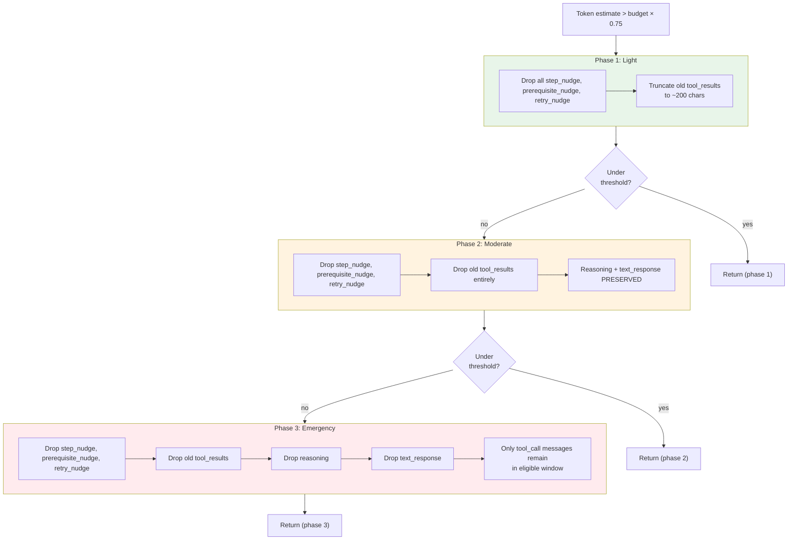
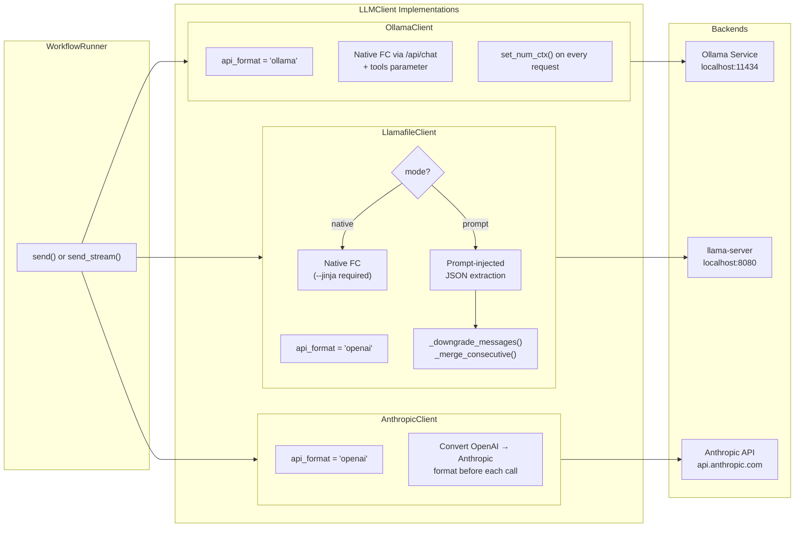
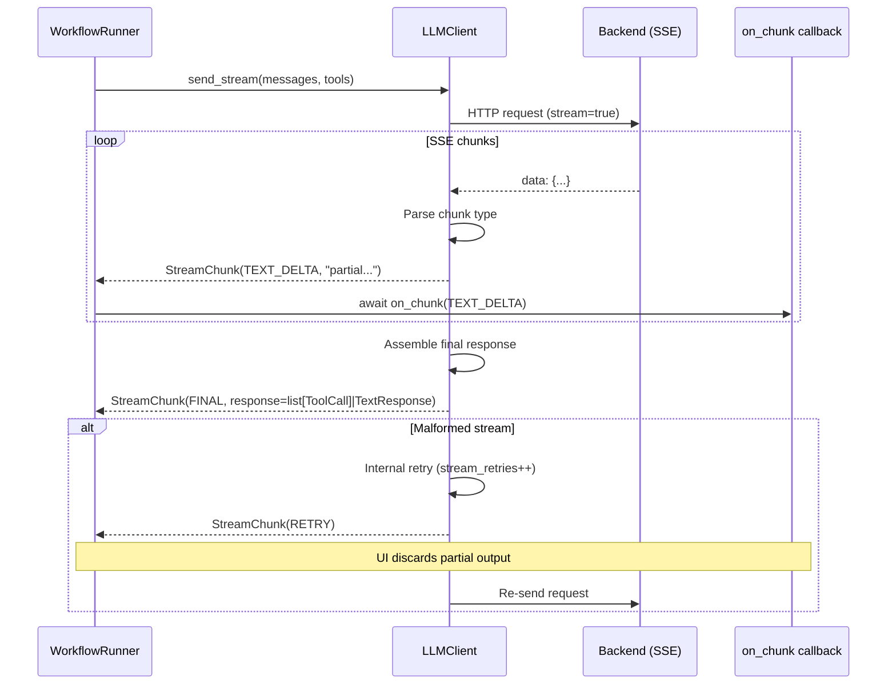
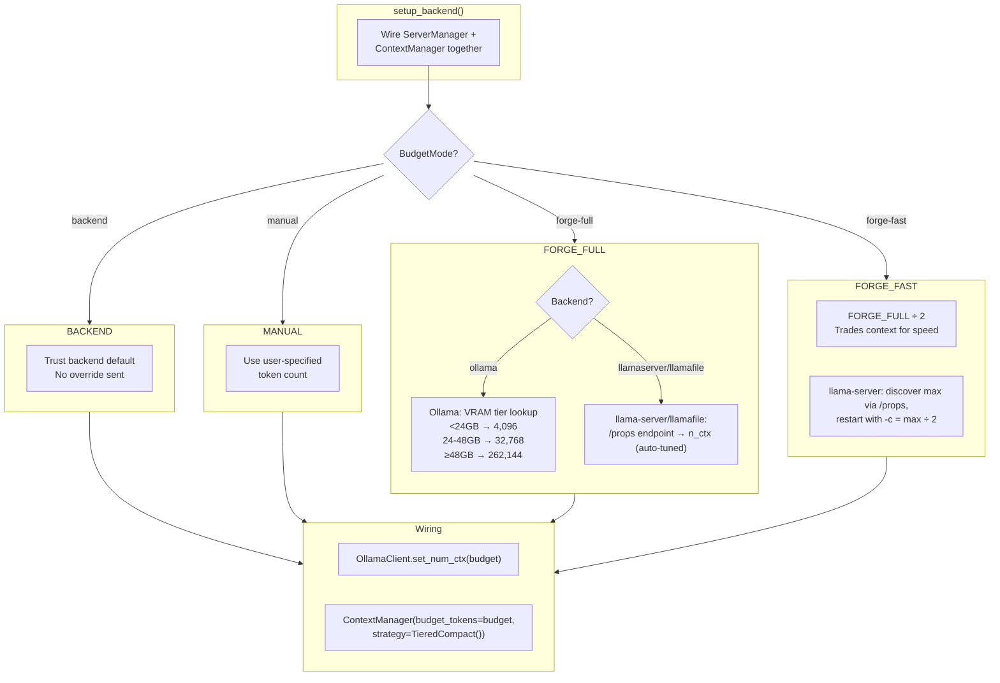
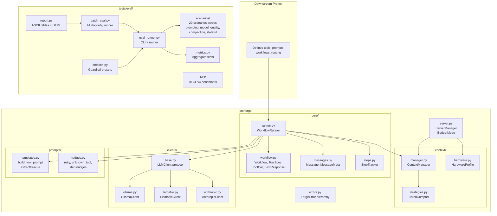

# Workflow

Visual guide to the forge agentic tool-calling loop.

---

## Quick Reference

**Entry Point:** `WorkflowRunner.run()` in `src/forge/core/runner.py`

**Critical Files:**
- `src/forge/core/inference.py` - run_inference() — shared "front half" (compact, fold, validate, retry)
- `src/forge/core/runner.py` - Agentic loop "back half" (step enforcement, tool execution, terminal check)
- `src/forge/core/workflow.py` - Workflow, ToolSpec, ToolCall, TextResponse
- `src/forge/core/messages.py` - Message, MessageRole, MessageType, MessageMeta
- `src/forge/core/steps.py` - StepTracker (used internally by StepEnforcer)
- `src/forge/guardrails/` - Composable middleware (ResponseValidator, StepEnforcer, ErrorTracker, Nudge)
- `src/forge/context/manager.py` - ContextManager, CompactEvent
- `src/forge/context/strategies.py` - TieredCompact (3-phase compaction)
- `src/forge/clients/base.py` - LLMClient protocol
- `src/forge/server.py` - ServerManager, BudgetMode, setup_backend()
- `src/forge/tools/respond.py` - Synthetic respond tool (respond_tool(), respond_spec())
- `src/forge/prompts/nudges.py` - Retry, unknown-tool, and step nudges
- `src/forge/prompts/templates.py` - Prompt-injected tool prompt, extract/rescue

---

## Agentic Loop

The core of forge. The runner delegates inference to `run_inference()` (the shared "front half" — compaction, reasoning folding, serialization, sending, validation, and retry), then handles step enforcement, tool execution, and terminal checks (the "back half"). The proxy also consumes `run_inference()` directly, sharing the same validation logic.



---

## Message Lifecycle

Every message flows through three stages: creation (with metadata), API serialization (metadata stripped, reasoning folded), and compaction eligibility (prioritized by type).



### Message Types and Compaction Priority

Messages are tagged with `MessageType` metadata that determines their compaction priority:

| MessageType | Role | Created By | Cut Order |
|-------------|------|-----------|-----------|
| `system_prompt` | system | Runner init | Never cut |
| `user_input` | user | Runner init | Never cut |
| `tool_call` | assistant | After LLM response | Never cut (all phases) |
| `tool_result` | tool | After tool execution | Truncated P1, dropped P2 |
| `reasoning` | assistant | Thinking models | Preserved through P2, dropped P3 |
| `text_response` | assistant | Failed tool call attempt | Preserved through P2, dropped P3 |
| `step_nudge` | user | Runner step enforcement | Dropped P1 |
| `prerequisite_nudge` | user | Runner prereq enforcement | Dropped P1 |
| `retry_nudge` | user | Runner retry logic | Dropped P1 |
| `summary` | system | Compaction output | Never cut |

---

## Compaction Phases

TieredCompact applies three escalating phases. Each phase fires only if the previous didn't reduce tokens below the threshold. All phases are deterministic text manipulation — no LLM calls.



**Protected window:** The `keep_recent` most recent loop iterations (default 2) are never compacted, regardless of phase. Only older messages in the eligible window are affected.

---

## Client Adapter Flow

The `LLMClient` protocol abstracts backend differences. The runner never sees raw HTTP — it gets `list[ToolCall] | TextResponse`. All clients also expose `get_context_length()` for budget discovery.



### Streaming Flow



---

## Budget Resolution

`ServerManager` resolves context budgets before the agentic loop starts. The budget flows into `ContextManager`, which uses it as the compaction threshold.



---

## Module Structure



---

## Data Types

### Core Types (`src/forge/core/workflow.py`)

```
Workflow
├── name: str
├── description: str
├── tools: dict[str, ToolDef]          # keyed by tool name
├── required_steps: list[str]          # must be called before terminal
├── terminal_tool: str | list[str]     # tool(s) that end the workflow
├── terminal_tools: frozenset[str]     # normalized (init=False)
└── system_prompt_template: str        # may contain {placeholders}

ToolDef
├── spec: ToolSpec
├── callable: Callable[..., Any]
└── prerequisites: list[str | dict]   # conditional dependencies (default [])

ToolSpec
├── name: str
├── description: str
└── parameters: type[BaseModel]        # dynamic Pydantic model (from_json_schema)

ToolCall
├── tool: str
├── args: dict[str, Any]
└── reasoning: str | None              # chain-of-thought (thinking models)

TextResponse
└── content: str                       # non-tool-call output
```

### Message Types (`src/forge/core/messages.py`)

```
ToolCallInfo (frozen)
├── name: str
├── args: dict[str, Any]
└── call_id: str

Message
├── role: MessageRole                  # system, user, assistant, tool
├── content: str
├── metadata: MessageMeta
│   ├── type: MessageType              # compaction priority tag
│   ├── step_index: int | None
│   ├── original_type: MessageType | None
│   └── token_estimate: int | None
├── tool_name: str | None              # for role="tool" results
├── tool_call_id: str | None           # OpenAI-format correlation
└── tool_calls: list[ToolCallInfo] | None  # for assistant tool calls (1+ entries)
```

### Streaming Types (`src/forge/clients/base.py`)

```
StreamChunk
├── type: ChunkType                    # TEXT_DELTA, TOOL_CALL_DELTA, FINAL, RETRY
├── content: str                       # partial text for deltas
└── response: LLMResponse | None       # only set when type == FINAL
```

---

## Command Reference

```bash
# Run unit tests (no backend needed)
python -m pytest tests/ -v --tb=short

# Run with coverage
python -m pytest tests/ --cov=forge --cov-report=term-missing

# Eval: single model, all scenarios
python -m tests.eval.eval_runner --backend ollama --model "ministral-3:8b-instruct-2512-q4_K_M" --runs 10 --stream --verbose

# Eval: specific scenarios
python -m tests.eval.eval_runner --backend ollama --model "ministral-3:8b-instruct-2512-q4_K_M" --runs 10 --scenario basic_2step sequential_3step

# Eval: llama-server (start server in separate terminal first)
python -m tests.eval.eval_runner --backend llamafile --llamafile-mode native --model ministral-14b-instruct-q4_k_m --runs 10 --stream

# Eval: Anthropic baseline
python -m tests.eval.eval_runner --backend anthropic --model claude-haiku-4-5-20251001 --runs 5 --stream

# Batch eval (multi-model, auto-resume)
python -m tests.eval.batch_eval --config ollama --runs 50

# Check batch progress
python -m tests.eval.report eval_results.jsonl --progress

# Probe context budget (no eval run)
python -m tests.eval.eval_runner --backend ollama --model "ministral-3:8b-instruct-2512-q4_K_M" --probe
```

See [ARCHITECTURE.md](ARCHITECTURE.md) for the full design document.
